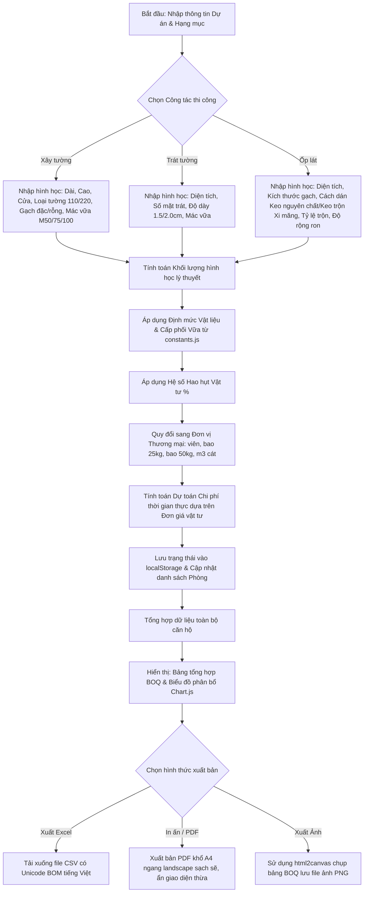

# Quy trình Công việc (Calculation Workflow) — Tool Tính Vật tư Xây - Trát - Ốp lát

Tài liệu này đặc tả luồng xử lý dữ liệu từ bước nhập liệu, tính toán trung gian, quy đổi thương mại, dự toán chi phí, trực quan hóa cho đến kết xuất BOQ cuối cùng.

---

---

## Các bước triển khai luồng xử lý dữ liệu trong Code (JS)

### 1. Khởi tạo & Phục hồi dữ liệu (Init phase)
*   **Bước 1.1**: Tải danh sách phòng và bảng đơn giá vật liệu mặc định từ `localStorage`. Nếu chưa có, nạp cấu hình mặc định (Hà Nội) từ `constants.js`.
*   **Bước 1.2**: Khởi tạo cấu trúc DOM, hiển thị Tab "Xây tường" mặc định và vẽ biểu đồ Chart.js trống.

### 2. Lắng nghe Sự kiện & Tính toán thời gian thực (Real-time Phase)
*   **Bước 2.1**: Gắn trình lắng nghe sự kiện `input` và `change` trên tất cả các trường dữ liệu của cả 3 công tác.
*   **Bước 2.2**: Khi có thay đổi, trigger hàm tính toán tương ứng trong `calculator.js`:
    - `calculateMasonry()`: Tính toán số lượng gạch, cát mịn, xi măng, nước dựa trên loại tường, diện tích xây và mác vữa xây.
    - `calculatePlastering()`: Tính thể tích vữa tô trát, cát mịn, xi măng, nước dựa trên độ dày trát và mác vữa trát.
    - `calculateTiling()`: Tính số viên gạch ốp lát, diện tích đóng hộp, số bao keo dán gạch (25kg), số bao xi măng trộn (50kg), lượng keo chà ron, ke cân bằng và ke chữ thập.
*   **Bước 2.3**: Áp dụng hệ số hao hụt tự động và thực hiện làm tròn lên (ceil) cho số bao thương mại.
*   **Bước 2.4**: Nhân với bảng đơn giá để ra tổng tiền dự toán của hạng mục đó.
*   **Bước 2.5**: Cập nhật kết quả tức thì lên màn hình (Real-time UI update).

### 3. Quản lý Hạng mục & Cộng dồn (Itemization Phase)
*   **Bước 3.1**: Cho phép người dùng click nút "Thêm vào bảng tổng hợp".
*   **Bước 3.2**: Thu thập toàn bộ kết quả tính toán của phòng/hạng mục hiện tại, thêm vào danh sách dự án.
*   **Bước 3.3**: Cập nhật bảng tổng hợp BOQ chung (cộng dồn xi măng, cát, gạch, keo, ke cân bằng từ tất cả các hạng mục).
*   **Bước 3.4**: Vẽ lại biểu đồ Chart.js phân bổ khối lượng vật tư tổng hợp.

### 4. Xuất bản & Sao lưu (Publication Phase)
*   **Bước 4.1 (Xuất CSV)**: Lấy dữ liệu bảng tổng hợp BOQ, chuyển thành định dạng CSV. Thêm ký tự BOM `\uFEFF` ở đầu file để Excel mở trực tiếp hiển thị đúng font Tiếng Việt có dấu.
*   **Bước 4.2 (Xuất PDF)**: Kích hoạt `window.print()`. CSS sẽ ẩn toàn bộ sidebar điều khiển, form nhập, các nút bấm, và chuyển hướng trang sang khổ giấy **A4 ngang (landscape)**.
*   **Bước 4.3 (Xuất Ảnh)**: Dùng `html2canvas` để render bảng BOQ thành ảnh Canvas, sau đó chuyển thành định dạng dataURL và tải xuống file ảnh PNG sắc nét.
*   **Bước 4.4 (Lưu JSON)**: Xuất toàn bộ mảng hạng mục dự án thành file `.json`. Hỗ trợ chức năng đọc file JSON để tải lại dự án cũ.
*   **Bước 4.5 (Audit Trail)**: Mọi thao tác xuất bản thành công sẽ được gọi hàm ghi log cục bộ (Audit Trail) để cập nhật vào nhật ký vận hành.

---

## 5. Điểm tương tác Con người (Human-in-the-Loop Points)

Quy trình lập trình giao diện và nghiệp vụ trong JS bắt buộc phải tôn trọng các điểm can thiệp và phê duyệt của con người để kiểm soát rủi ro:

*   **Điểm 5.1 (Khảo sát & Nhập liệu thô)**: Con người đo đạc thực tế tại căn hộ và nhập kích thước hình học thô (Dài, Cao, diện tích cửa) vào form. Hệ thống chỉ xử lý dữ liệu khi có hành động nhập.
*   **Điểm 5.2 (Điều chỉnh Đơn giá & % Hao hụt)**: Thiết kế giao diện cho phép người dùng click sửa trực tiếp bảng Đơn giá vật tư địa phương và tỷ lệ % hao hụt của từng phân khu. Hệ thống tự động ghi nhớ vào `localStorage` và cập nhật lại dự toán tức thì (không được khóa cứng trị số mặc định).
*   **Điểm 5.3 (Kiểm duyệt & Phê duyệt BOQ cuối)**:
    - Hiển thị bảng tổng hợp BOQ thô để con người đối chiếu, rà soát với thợ thi công.
    - Bắt buộc hiển thị dòng cảnh báo nghiệp vụ (Disclaimer) rõ ràng màu vàng/cam ở chân bảng BOQ trên UI và trên bản in PDF để nhắc nhở con người rà soát trước khi mua sắm chính thức.
    - Con người quyết định phê duyệt bằng hành động nhấp nút "In/Xuất PDF" hoặc "Xuất Ảnh PNG" để đưa vào sử dụng thực tế.
